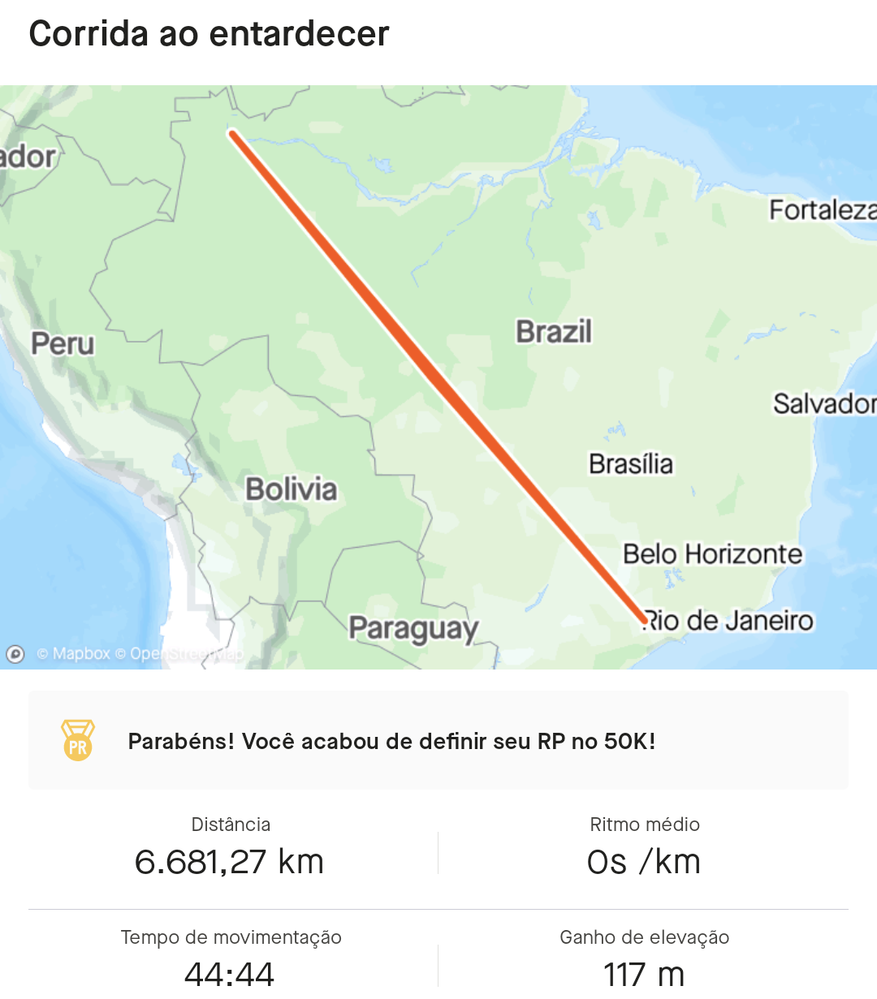

# tcxFix

This is a little application I made to help fixing workouts that had some problems with the location tracking.

One day I went running with my Amazfit GTR Mini and when done, this absurd map showed up in Strava:



New world record, lol.

And basically this repo contains a script that tries to fix the workout by removing the invalid locations registered during the activity.

It works by modifying a .tcx file removing the invalid locations based on a condition

In my case I had the activity registered in the Zepp App and I exported the activity as a tcx, modified it with this script and uploaded to Strava after.

## Usage

Clone this repo

```sh
git clone https://github.com/V11-0/tcxFix.git
```

Copy the tcx files you want to fix into the folder of the script

Run

```sh
dotnet run
```

It will remove the invalid locations and create a new file in the folder with the corrections.

### Condition for removing locations

In my case, the tcx file had the corrupted coordinates containing the string "E-" while the correct coordinates were in the [Decimal Degree](https://en.wikipedia.org/wiki/Decimal_degrees) format (-xx.xxxx).

Give a look at your tcx file before running this script to understand how you can identify corrupted coordinates, I used this string check with "E-", but in your case, this condition may be different.